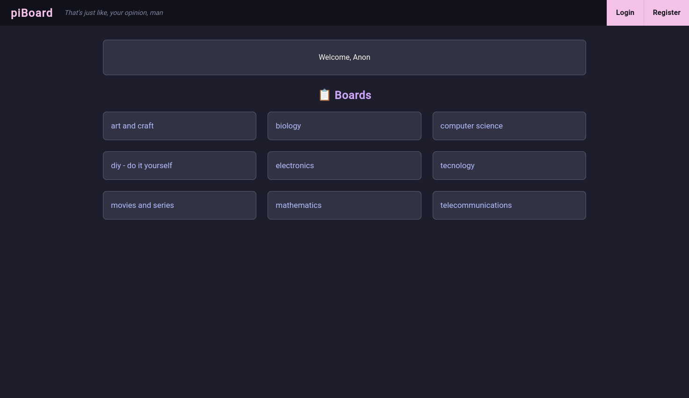
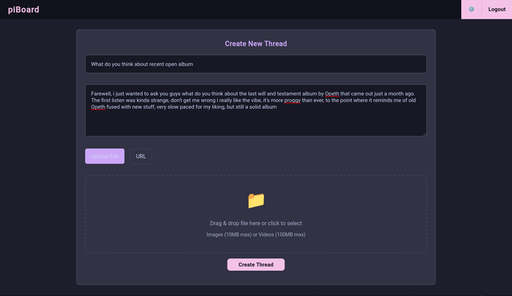
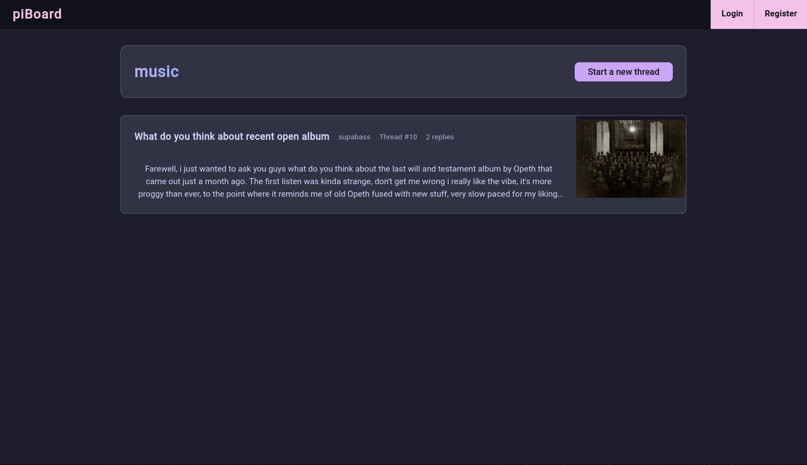
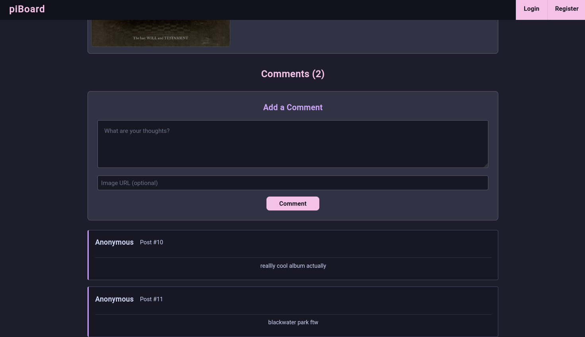

# piBoard

A lightweight PHP-based imageboard platform with modern features and clean design.

## Features

- Create and manage discussion boards
- Thread-based conversations with image uploads
- User authentication and registration
- Admin panel for moderation
- Ban system for user management
- Some things are designed for mobile(working on it sometimes in the future)

## Screenshots

### Main Board View

### Create Thread

### Thread List

### Comments

## Tech Stack

- **Backend**: PHP
- **Database**: MariaDB/MySQL
- **Frontend**: Vanilla JavaScript, CSS

## Quick Start

1. Clone the repository
2. Configure database settings in `.env`
3. Run setup script or just import mariadb database: `./setup_database.sh`
4. Deploy: `./deploy.sh`

## Requirements

- PHP 7.4+
- MariaDB/MySQL
- Web server (Apache/Nginx)
